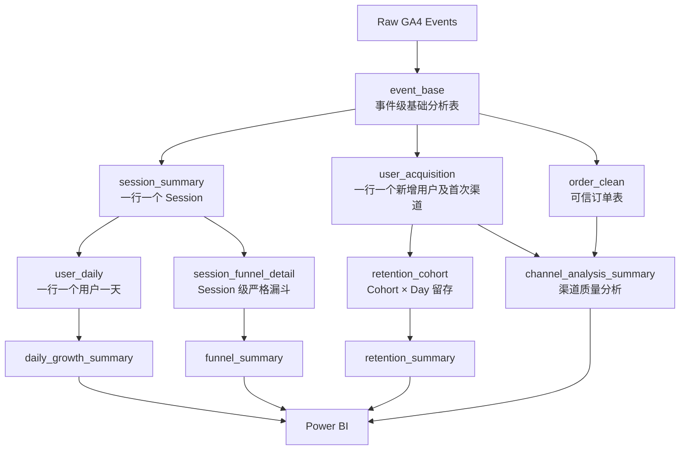
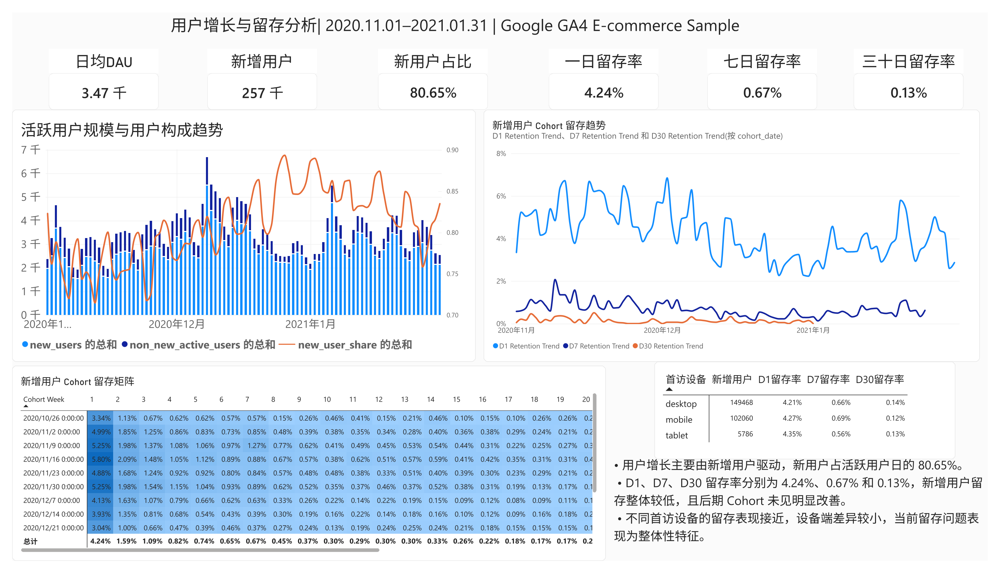
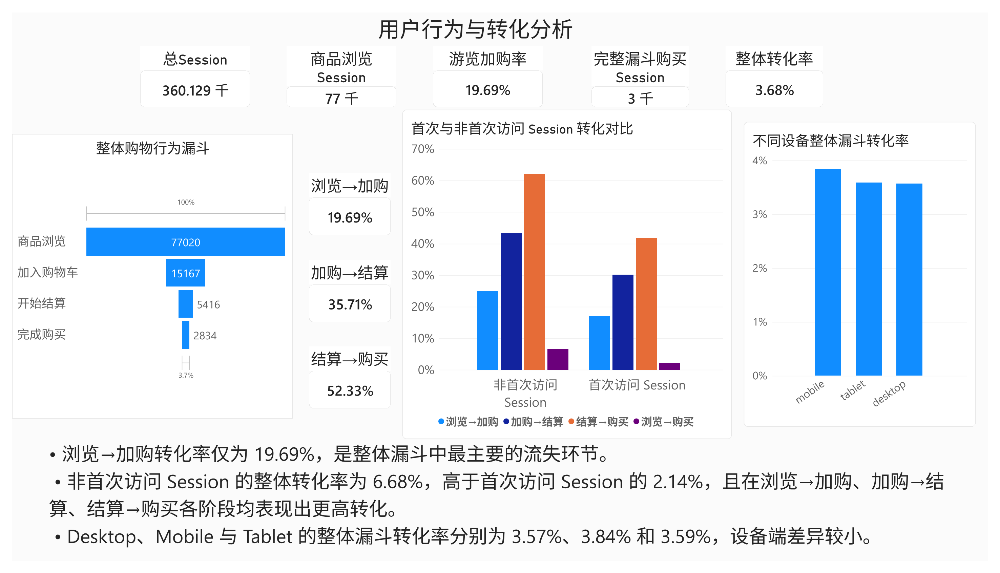
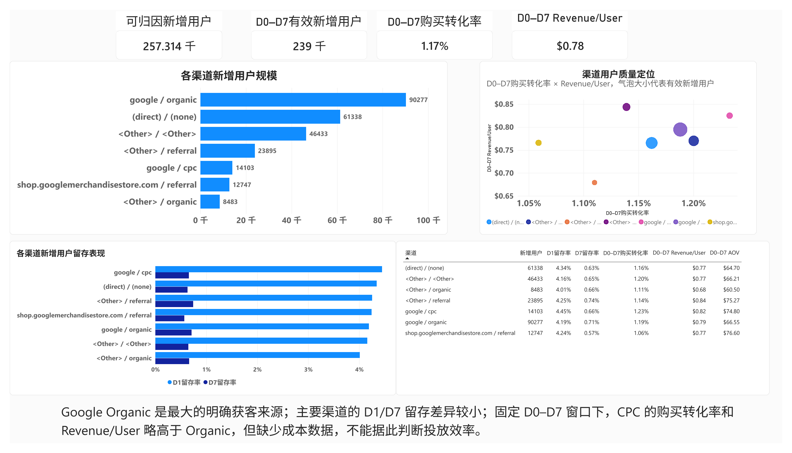

# Google GA4 E-commerce Growth & Conversion Analysis

基于 429 万条 GA4 Event，完成从数据质量审计、指标口径设计、用户与 Session 建模，到 Power BI 业务看板的端到端电商增长与转化分析。

## Project Overview

项目使用 Google Merchandise Store 的公开 GA4 BigQuery 电商样例数据，围绕用户增长、留存、购物漏斗和首次获客渠道质量展开分析。重点不只是展示 Dashboard，而是先解决 GA4 事件数据中的 Session 缺失与重复、订单去重、观察窗口偏差、渠道归因边界等问题，再输出可解释的业务指标。

分析主线：

`Acquisition → Session → View Item → Add to Cart → Begin Checkout → Purchase → Retention → Channel Quality`

最终形成三个分析模块：

1. 用户增长与留存
2. 用户行为与转化
3. 获客渠道质量

## Business Questions

| Business Question | Method | Output |
|---|---|---|
| 流量增长是否带来有效用户？增长由谁驱动？ | 日粒度拆分新增用户与观察期内其他活跃用户 | 用户规模、构成与趋势 |
| 新增用户能否持续留存？ | `first_visit` Cohort + Exact-day Retention | D1 / D7 / D30 留存及设备差异 |
| 用户主要流失在哪个购物环节？ | 同一 Session 内按时间顺序构建严格漏斗 | 各阶段 Session 数与转化率 |
| 首次访问与非首次访问 Session 表现是否不同？ | 以 `first_visit` 所在 Session 分组对比 | 分阶段及完整漏斗转化率 |
| 不同首次获客渠道的用户质量有何差异？ | 统一 D0-D7 观察窗口，比较规模、留存、购买与 Revenue/User | 渠道质量定位与边界明确的业务解读 |

## Dataset

- 数据集：[GA4 Obfuscated Sample Ecommerce Dataset](https://developers.google.com/analytics/bigquery/web-ecommerce-demo-dataset)
- BigQuery 表：`bigquery-public-data.ga4_obfuscated_sample_ecommerce.events_*`
- 业务来源：Google Merchandise Store（公开、混淆后的事件级样例数据）
- 分析区间：2020-11-01 至 2021-01-31，共 92 天
- 数据规模：4,295,584 条 Event；270,154 个匿名 `user_pseudo_id`
- 用户边界：`user_pseudo_id` 是浏览器/设备级匿名标识，不等同于真实自然人，也不能可靠识别跨设备用户

## Tech Stack

| 工具 | 用途 |
|---|---|
| BigQuery SQL | 解析 GA4 嵌套字段、数据审计、Session / 用户 / 订单建模及汇总表构建 |
| Python | 结果核验与辅助分析 |
| Power BI / DAX | 指标计算、交互式可视化与业务看板 |

## Analysis Workflow

1. 审计原始 Event、Session、`transaction_id`、用户首次访问和流量来源字段。
2. 统一 Session、新用户、有效订单、留存与渠道归因口径。
3. 构建日粒度增长、Cohort 留存、严格 Session Funnel 和渠道质量分析表。
4. 在 Power BI 中呈现核心指标，并仅对数据能够支持的现象作业务解释。

## Data Quality & Metric Definitions

### Session：用唯一键而不是 `session_start` 计数

- 从 `event_params` 提取 `ga_session_id` 和 `ga_session_number`。
- Session Key 定义为 `user_pseudo_id + ga_session_id`，得到 **360,129** 个唯一 Session；原始数据仅有 **354,970** 条 `session_start` Event。
- 审计发现 **5,272** 个 Session 没有 `session_start`，另有 **105** 个 Session 含多个 `session_start`，因此事件数不能直接代表 Session 数。
- **845** 个 Session 跨自然日。`session_date` 取该 Session 最早 Event 的日期，日粒度统计基于 `session_summary.session_date`，避免跨日 Session 被重复计算。

### Order：购买行为与可信交易分开建模

- 原始数据有 **5,692** 条 `purchase` Event，但存在空值、`(not set)`、重复 `transaction_id`、重复购买事件及部分重复记录 Revenue 不一致。
- 有效订单键为 `user_pseudo_id + transaction_id`；过滤无效 ID 后去重，重复记录保留最早 `event_timestamp`。
- `order_clean` 最终得到 **4,466** 个有效订单、**3,713** 个有效订单用户、约 **$308,830** Revenue。
- 严格漏斗使用 `purchase` Event 判断 Session 是否到达购买行为；订单数、Revenue 与 AOV 则使用 `order_clean`。两类指标回答的问题不同，不能混用。

### New User：用 `first_visit` 避免左截断误判

- 不使用观察期内的 `MIN(event_date)` 定义新用户，因为数据开始前已访问过的用户会被误判。
- 新用户定义为触发 `first_visit` 的用户，共 **257,314** 人。
- 总匿名用户为 **270,154**；其余 **12,840** 人记为 `non_new_active_users`，而不直接称为 returning users。

### Retention：Exact-day 口径并处理右删失

- 用户按 `first_visit_date` 进入 Cohort，再通过 `session_date` 判断是否在第 N 天活跃。
- D1 / D7 / D30 表示“恰好第 1 / 7 / 30 天再次活跃”，不是“N 天内至少回来一次”。
- 数据截止于 2021-01-31；仅纳入拥有完整观察窗口的 Cohort，避免把尚未获得足够观察时间的用户记为未留存。
- 加权整体留存率为 **D1 4.24% / D7 0.67% / D30 0.13%**。

### Attribution：限定为 First-user Acquisition

- 渠道由 `first_user_source + first_user_medium` 组成，如 `google / organic`、`google / cpc`、`(direct) / (none)`。
- 该分析回答用户最初从哪里被获取，不等同于 Session-level 或 Last-click Attribution。
- 历史样例数据缺少可直接使用的 `session_traffic_source_last_click`，因此不强行重建当前 Session Channel。
- `<Other>` 为公开样例中的混淆来源，只纳入总体统计，不作具体策略解释；`shop.googlemerchandisestore.com / referral` 可能包含 self-referral，也需谨慎解读。

### Fixed Window：统一渠道比较周期

- 不直接比较整个观察期累计表现：11 月获客用户拥有更长的转化时间，而 1 月用户的可观察时间更短。
- 渠道质量统一使用 **D0-D7**（首访当日至第 7 天，共 8 个自然日）窗口，仅纳入 `first_visit_date <= 2021-01-24` 的 **238,649** 个新增用户。
- 汇总指标以 `SUM(分子) / SUM(分母)` 计算，不对各渠道转化率做简单平均。

## Data Model / Analysis Pipeline



## Key Analysis

### 1. User Growth & Retention

- **Question：** 用户增长来自新增用户还是观察期内其他活跃用户？新增用户能否留下？
- **Method：** 日粒度用户构成 + `first_visit` Cohort + Exact-day Retention，并对 D1 / D7 / D30 分别处理完整观察窗口。
- **Result：** 按用户日加权计算，新用户占活跃用户约 **80.65%**，增长主要由新增用户驱动；D1 / D7 / D30 留存约为 **4.24% / 0.67% / 0.13%**。后期 Cohort 未显示持续、明显的改善，不同首访设备的留存差异较小。

### 2. Session Funnel & Conversion

漏斗要求所有阶段发生在同一 Session，且严格遵循 `event_timestamp`：

`first_view → first_cart after view → first_checkout after cart → first_purchase after checkout`

同一 Session 即使多次触发某一事件，每个阶段也最多贡献 1 个 Session。

| Funnel Stage | Sessions | Stage Conversion |
|---|---:|---:|
| Total Sessions | 360,129 | — |
| View Item | 77,020 | — |
| Add to Cart | 15,167 | View → Cart：19.69% |
| Begin Checkout | 5,416 | Cart → Checkout：35.71% |
| Purchase | 2,834 | Checkout → Purchase：52.33% |
| View → Purchase | — | **3.68%** |

最大流失发生在 **View Item → Add to Cart**。该结果定位了需进一步调查的环节，但现有数据不能证明流失由商品页设计、价格或其他具体因素导致。

首次访问 Session 指用户 `first_visit` 所在 Session，其余为非首次访问 Session；这不是简单的“新用户 vs 老用户”分类。

| Session Type | View → Cart | Cart → Checkout | Checkout → Purchase | View → Purchase |
|---|---:|---:|---:|---:|
| 首次访问 Session | 17.03% | 30.10% | 41.78% | 2.14% |
| 非首次访问 Session | 24.90% | 43.20% | 62.14% | 6.68% |

非首次访问 Session 在各阶段均显示更高转化，但这是相关性结果，不代表已经识别出因果机制。Desktop、Mobile、Tablet 的完整漏斗转化率约为 3.6%–3.8%，设备差异较小。

### 3. Acquisition Channel Quality

- **Question：** 哪些首次获客渠道同时具备规模和用户质量？
- **Method：** 在统一 D0-D7 窗口内，以 Purchase Conversion、Revenue/User、AOV 和留存共同评价渠道；气泡大小代表 Eligible New Users。
- **Result：** `google / organic` 是最大的明确获客来源。主要渠道的 D1 / D7 留存整体接近；`google / cpc` 的 D0-D7 Purchase Conversion 与 Revenue/User 略高于 Organic，但差异不大。
- **Decision boundary：** 数据没有广告成本，不能计算 ROI / ROAS，也不足以直接提出预算分配建议。

## Power BI Dashboard

### Page 1 — 用户增长与留存分析



展示 Avg DAU、新增用户占比、Exact-day Retention、Cohort 留存矩阵及设备留存表现。

### Page 2 — 用户行为与转化分析



展示严格 Session Funnel、首次与非首次访问 Session 对比，以及设备端完整漏斗转化率。

### Page 3 — 获客渠道质量分析



在统一 D0-D7 窗口下，从规模、留存、Purchase Conversion、Revenue/User 与 AOV 比较首次获客渠道。

## Key Findings

1. 按用户日加权计算，新增用户占活跃用户约 **80.65%**，用户规模主要依赖持续获客。
2. Exact-day Retention 为 **D1 4.24%、D7 0.67%、D30 0.13%**；后期 Cohort 未呈现持续改善。
3. 严格漏斗的最大流失位于 **View Item → Add to Cart**，该阶段转化率为 **19.69%**。
4. 非首次访问 Session 的完整漏斗转化率为 **6.68%**，高于首次访问 Session 的 **2.14%**，且各阶段均呈现相同方向。
5. 设备端完整漏斗转化率约为 **3.6%–3.8%**，现有数据未显示明显设备差距。
6. `google / organic` 是最大的明确首次获客来源；`google / cpc` 在 D0-D7 购买转化和 Revenue/User 上略高，但没有成本数据，不能据此判断投放效率。

## Data Limitations

- 数据为公开且经过混淆的 GA4 样例，`<Other>`、`(data deleted)` 等值限制了细粒度来源解释。
- `user_pseudo_id` 不是自然人 ID，无法可靠处理跨浏览器、跨设备身份合并。
- `transaction_id` 存在无效值、重复及 Revenue 不一致，交易指标依赖清洗后的订单口径。
- 历史数据缺少可直接使用的 Session-level Last-click 字段，渠道结论仅适用于 First-user Acquisition。
- 留存与固定窗口指标必须处理右删失；不同分析窗口的结果不能直接混比。
- `add_to_cart` 存在明显的日采集异常，因此短期日趋势需谨慎解释。
- 缺少广告成本、利润和毛利数据，无法计算 ROI、ROAS 或利润贡献，也不能直接支持预算分配。
- 观察性数据支持相关性描述，不足以单独识别转化差异的因果原因。

## Repository Structure

```text
.
├── README.md
├── assets/
│   └── dashboard/
│       ├── growth_retention.png
│       ├── funnel_conversion.png
│       └── channel_quality.png
├── data/
│   ├── 01_daily_growth_summary.csv
│   ├── 02_retention_summary.csv.csv
│   ├── 03_retention_cohort.csv.csv
│   ├── 04_device_retention_summary.csv.csv
│   ├── 05_funnel_summary.csv.csv
│   ├── 06_daily_funnel_summary.csv.csv
│   ├── 07_channel_analysis_summary.csv.csv
│   └── 这个不导入powerbi中07_channel_summary.csv.csv
├── dashbord_G4A/
│   ├── 0.png
│   ├── 1.png
│   └── 2.png
├── dashbord_G4A.pbix
├── dashbord_G4A.pdf
└── dashbord_G4A.zip
```

> 当前工作副本包含分析结果 CSV 与 Power BI 交付物，尚未包含 SQL / Python 源文件。README 中的数据模型与指标口径对应本项目分析流程；如用于作品集公开展示，建议后续补充可复现的查询脚本。

## Skills Demonstrated

- BigQuery SQL 与 GA4 嵌套事件数据建模
- 数据质量审计、Sessionization 与交易去重
- 指标口径设计与业务规则落地
- Cohort Analysis、右删失处理与 Exact-day Retention
- 严格顺序 Session Funnel 与分群比较
- First-user Attribution 与公平观察窗口设计
- Power BI / DAX 数据可视化
- 从分析证据到业务结论的边界控制
